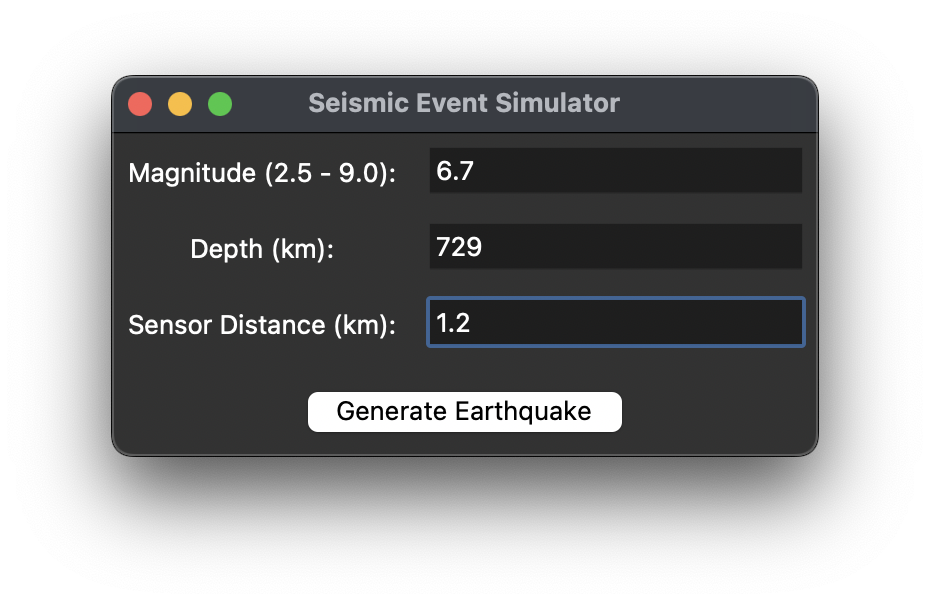
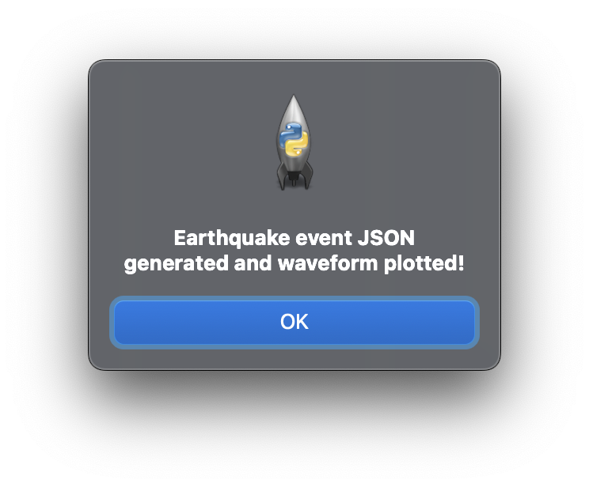
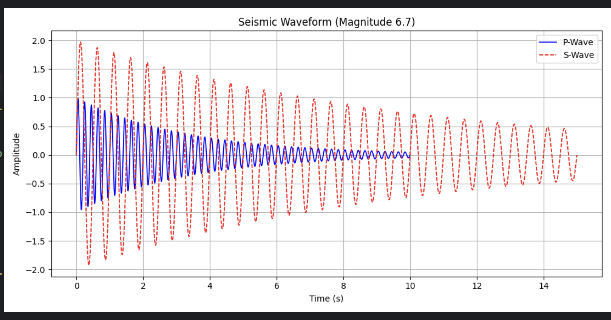
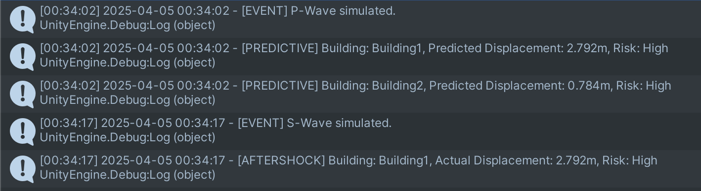

# Earthquake Simulator

## Overview

**Earthquake Simulator** is a hybrid **Unity + Python** application designed to simulate real-time seismic activity, visualize earthquake impacts on buildings, and perform predictive structural analysis.

It reads **real earthquake wave data in JSON format**, simulates **P-wave** and **S-wave** effects, and provides early warnings and risk assessments based on realistic structural parameters like **elastic modulus** and **moment of inertia**.

**Purpose:** Educational and training tool to demonstrate earthquake behavior and real-time structural vulnerability.

---

## Features

### 1. Real-time Data-Driven Simulation
- Reads `earthquake_data.json` containing magnitude, P-wave, and S-wave arrival times.
- Triggers Unity-based seismic simulation based on this data.

### 2. P-Wave and S-Wave Simulation
- **P-Wave (Primary Wave)**  
  - Fast, low-intensity  
  - Simulated with subtle camera shake
- **S-Wave (Secondary Wave)**  
  - Slower but high-intensity  
  - Simulated with intense shake and structural displacement
- Real-time alerts and visual feedback change depending on wave type and severity.

### 3. Building Displacement & Risk Analysis
- Every structure undergoes physics-based evaluation:
  - Factors used:
    - Elastic Modulus
    - Moment of Inertia
    - Height & Floor Count
- Risk levels:
  - Green = Low
  - Yellow = Medium
  - Red = High
- Predictive analysis runs before S-wave arrives.

### 4. Visual & Structural Feedback
- Buildings tilt based on impact severity.
- Color-coded risk visualization:
  - Green = Safe
  - Yellow = Moderate risk
  - Red = High risk
- Flashing alerts for high-risk cases.

### 5. Seismic Event Logging
- Logs all simulations to:  
  `Application.persistentDataPath/earthquake_log.txt`
- Includes:
  - Timestamped entries
  - Wave detection
  - Displacement
  - Risk classification

---

## Screenshots

| Description | Image |
|------------|--------|
| P-Wave Detection |  |
| Predictive Warning |  |
| S-Wave Impact |  |
| Tilted Buildings |  |
| Log File Output |  |

---

## How to Use

### Unity Setup
1. Open project in **Unity 2021.3+**.
2. Assign building prefabs to the `EarthquakeManager` script.
3. Place `earthquake_data.json` in the `StreamingAssets` folder.

### Python Script
- Use `generate_earthquake_data.py` to create sample data.
- Save the file in `StreamingAssets` or update Unity path accordingly.

### Running the Simulation
- Hit **Play** in Unity Editor.
- Unity checks for new JSON data every 5 seconds.
- When detected, simulation auto-starts with correct wave sequencing.

---

## Requirements

### Unity
- **Version**: 2021.3+ (LTS Recommended)  
- **Packages**:  
  - TextMeshPro (for on-screen warnings)

### Python (Optional - for JSON generation)
- **Version**: 3.8+
- **Dependencies**: None (Pure Python)

---

## Customization

All customization can be done in `EarthquakeManager.cs`:

| Function | Description |
|----------|-------------|
| `ShakeCamera()` | Tune intensity & duration for P/S waves |
| `CalculateDisplacement()` | Adjust structural impact via force multipliers |
| `GetCautionLevel()` | Modify displacement thresholds for risk levels |
| `TiltBuilding()` | Change tilt degree and animation timing |

---

## License

Free to use for **educational and research** purposes.  
Credit is appreciated if reused or modified.

---

## Author

**Developed by:**  
**Chinmay HS** & **Mahima AG**  
Focus: Real-time physics simulation + data-driven structural analysis in seismic zones.

