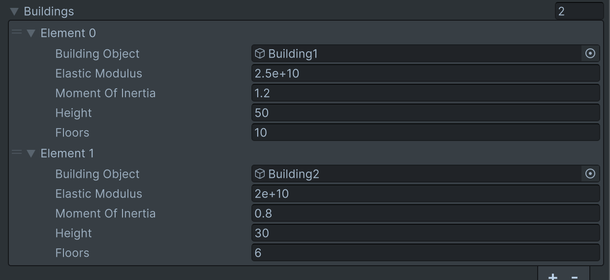

```markdown
# Earthquake Simulator

## Overview

This Earthquake Simulator is a hybrid Unity + Python application designed to simulate real-time seismic activity, visualize the impact of earthquakes on buildings, and perform predictive structural analysis. It reads real earthquake wave data in JSON format, simulates P-wave and S-wave effects, and provides early warning and risk assessment per building based on realistic parameters like elastic modulus and moment of inertia.

The system is tailored for educational and training purposes to demonstrate earthquake behavior and structural vulnerability in real time.

---

## Features

### 1. Real-time Data-Driven Simulation
- Reads a JSON file (`earthquake_data.json`) containing magnitude, P-wave, and S-wave arrival times.
- Simulates shaking events in Unity to mimic real seismic activity.

### 2. P-Wave and S-Wave Simulation
- **P-Wave (Primary Wave):** Lighter, faster, and non-destructive. Simulated with light camera shake.
- **S-Wave (Secondary Wave):** Slower but much stronger. Simulated with intense shaking and structure displacement.
- Alerts and visual feedback change based on wave type and severity.

### 3. Building Displacement & Risk Analysis
- Every building is evaluated using physics-based calculations:
  - Displacement is calculated from:
    - Elastic Modulus
    - Moment of Inertia
    - Building height and number of floors
  - Risk is classified as Low, Medium, or High.
- Predictive analysis is done *before* S-wave hits.

### 4. Visual & Structural Feedback
- Buildings visually tilt based on severity.
- Color-coded risk:
  - Green = Safe
  - Yellow = Moderate risk
  - Red = High risk
- In high-risk cases, a warning is raised with a flashing alert sign.

### 5. Logging
- All seismic events and analysis results are logged in `Application.persistentDataPath/earthquake_log.txt`.
- Format includes timestamps and descriptions, useful for post-simulation reviews.

---

## Folder Structure

```
EarthquakeSimulator/
├── Assets/
│   └── Scripts/
│       └── EarthquakeManager.cs
├── python_scripts/
│   ├── generate_earthquake_data.py
│   └── Screenshots/
│       ├── ss1.png
│       ├── ss2.png
│       ├── ss3.png
│       ├── ss4.png
│       └── ss5.png
└── StreamingAssets/
    └── earthquake_data.json
```

---

## Screenshots




---

## How to Use

### 1. Unity Setup
- Open the project in Unity.
- Ensure your building prefabs are assigned in the `EarthquakeManager` component.
- Place `earthquake_data.json` inside the `StreamingAssets` folder.

### 2. Python Script
- `generate_earthquake_data.py` generates sample JSON data.
- Place it in `StreamingAssets` or point to the correct path in Unity.

### 3. Play Simulation
- Press **Play** in Unity Editor.
- The script checks every 5 seconds for updated earthquake data.
- When a file is detected, simulation begins automatically with proper sequencing.

---

## Requirements

### Unity
- Unity 2021.3+ (Tested on LTS)
- TextMeshPro (for on-screen alerts)

### Python (Optional for JSON Generation)
- Python 3.8+
- No third-party dependencies

---

## Customization

You can adjust the following parameters inside `EarthquakeManager.cs`:

- `ShakeCamera()` → Adjust intensity & duration for different waves.
- `CalculateDisplacement()` → Tune force multiplier and structural sensitivity.
- `GetCautionLevel()` → Adjust displacement thresholds for risk classification.
- `TiltBuilding()` → Control tilt angle and duration per building.

---

## License

This project is free to use for educational and research purposes. Credit is appreciated if reused or modified.

---

## Author

Developed by Chinmay HS & Mahima AG.
Focus: Real-time physical simulation + data-driven analysis for structural response in seismic environments.
```

---

Let me know if you want a version saved to a file or placed in your Unity project automatically.